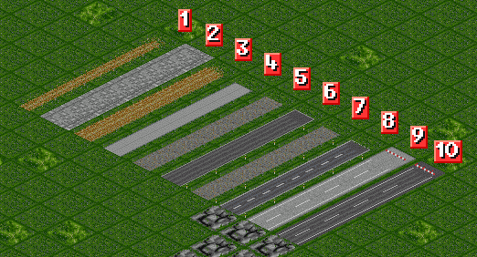

# AB-Roads

An attempt to build a simple road-GRF, satisfying my own requirements to have paths and streets for rural and urban areas, interurban streets and tram tracks for urban areas and interurban connections. AB-Roads means literally Auge's Basic Roads.

This set is licenced under the terms of GPL2. You can find a copy of the license in the file LICENSE.md.

The currently available relase is version 0.1.1 (codename Daisy).

## Roads

These are the planned road types.

| No. | Name                        | Speed Limit | Vehicles | Houses | Rail Crossing | Introduction Date |
| ---:| --------------------------- | ----------- | -------- | ------ | ------------- | -----------------:|
| 1   | foot path                   | 0 km/h      | No       | Yes    | No            | 0                 |
| 2   | precinct/pedestrian zone    | 0 km/h      | No       | Yes    | No            | 1960              |
| 3   | dirt road                   | 30km/h      | Yes      | No     | Yes           | 0                 |
| 4   | concrete accommodation road | 50km/h      | Yes      | No     | Yes           | 1955              |
| 5   | set paved town road         | 40km/h      | Yes      | Yes    | Yes           | 0                 |
| 6   | asphalt town road           | 50km/h      | Yes      | Yes    | Yes           | 1960              |
| 7   | set paved country road      | 70km/h      | Yes      | No     | Yes           | 0                 |
| 8   | asphalt country road        | 90km/h      | Yes      | No     | Yes           | 1970              |
| 9   | highway (1st generation)    | 90km/h      | Yes      | No     | No            | 1930              |
| 10  | highway (2nd generation)    | 120km/h     | Yes      | No     | No            | 1975              |

## Help, artwork and code

The most sprites and the code are adopted from or at least inspired by other GPL-2-licensed sets of the following authors:

- GarryG
- Kruemelchen
- Andrew350
- Ufiby
- supermop
- Timberwolf

I'm sorry if I forgot someone. If so, remind me please. Thank you all.
